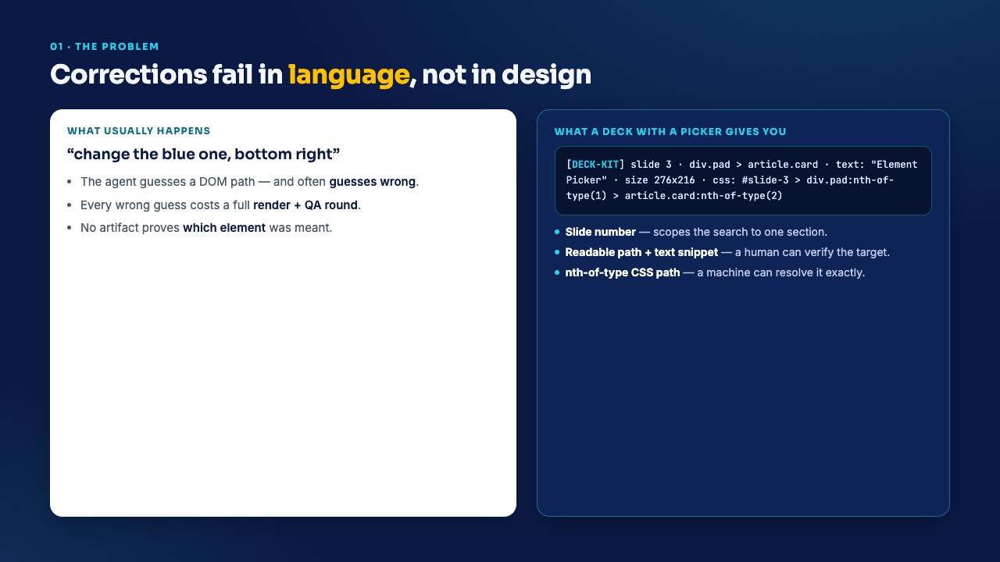
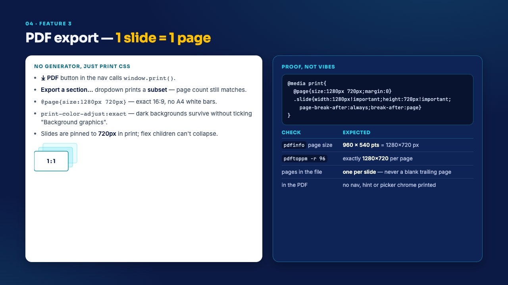
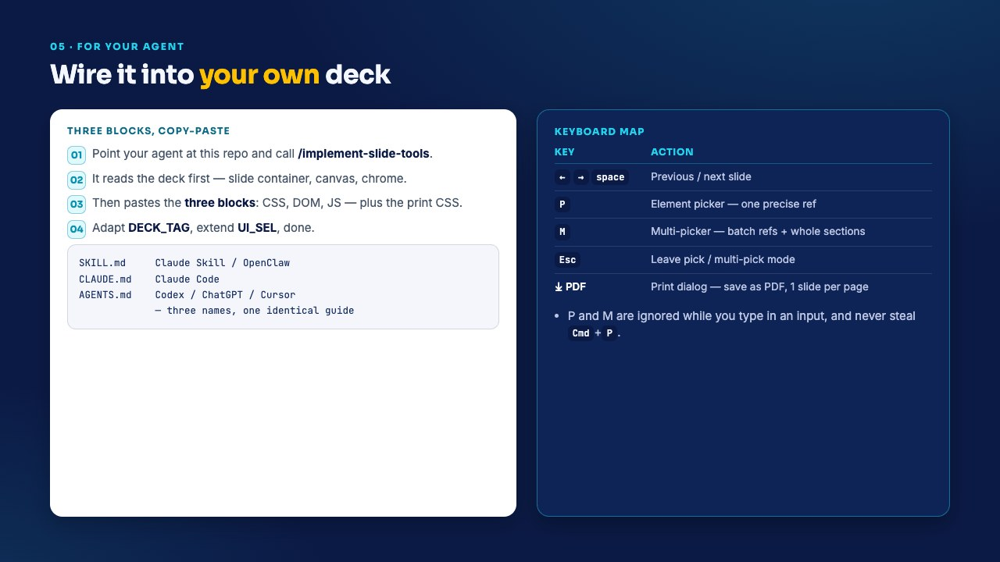

# ai-presentation-html-deck-toolkit

An HTML slide deck that an AI agent can be told to fix **precisely** — because the deck itself hands
you a machine-locatable reference to whatever you point at.

Three features, one HTML file, no dependencies, no build step:

| Feature | Trigger | What it does |
|---|---|---|
| **Element picker** | <kbd>P</kbd> | Hover + click an element → copies a precise reference string |
| **Multi-picker** | <kbd>M</kbd> | Select many elements, or a whole slide → copies one batch |
| **PDF export** | nav button | `window.print()` → 1 slide = 1 page, 1280×720, backgrounds intact |


## Try it

```bash
git clone git@github.com:JudgeRozin/ai-presentation-html-deck-toolkit.git
cd ai-presentation-html-deck-toolkit
open skills/implement-slide-tools/deck.html    # macOS; xdg-open on Linux, start on Windows
```

Press <kbd>P</kbd>, click any element — the reference lands on your clipboard. Press <kbd>M</kbd>,
click a few elements plus a slide corner <kbd>⊕</kbd>, then **Copy refs**. Hit <kbd>⤓ PDF</kbd> in the
nav to save the deck as a PDF, one slide per page.

| Pick mode — hover marks, click copies | Multi-pick — batch refs, ⊕ grabs a section |
|---|---|
|  |  |

## The problem it solves

You ask an agent to change something and say *"the blue one, bottom right"*. The agent guesses a DOM
path, guesses wrong, and you pay for a render-and-review round. The picker replaces that guess with a
reference three locators wide:

```
[DECK-KIT] slide 3 · div.pad > article.card · text: "Element Picker" · size 276x216 · css: #slide-3 > div.pad:nth-of-type(1) > article.card:nth-of-type(2)
```

| Part | Job |
|---|---|
| `[DECK-KIT]` | Deck tag — which deck it came from when several are open |
| `slide 3` | Bounds the lookup to one section |
| `div.pad > article.card` + `text:` | Readable path and snippet — a human verifies the target by reading it |
| `css: …:nth-of-type(2)` | Disambiguated selector — a script or agent resolves it exactly |

A multi-pick batch starts with a count header (`# DECK-KIT multi-selection (3 refs)`) and lists the
references in **DOM order**, so the paste reads like the deck and the receiving agent can assert
nothing was dropped.

The reference above points at a `<b>` inside a dark card — which is how the deck's own 1.12:1
contrast bug was found. That measurement, and the two fixes it produced, are in
[`SKILL.md` §4](skills/implement-slide-tools/SKILL.md).

| What the picker gives you | The PDF export |
|---|---|
|  |  |

---

## For AI agents

This repository is built to be consumed by an agent, not just read by a human. The skill lives at
the path agent tooling expects:

```
skills/implement-slide-tools/
├── SKILL.md     the guide: read this, then paste into the target deck
└── deck.html    the worked example, with all three features installed
```

`SKILL.md` is self-sufficient: it carries the full copy-paste blocks for all three features, the
adaptation points (`DECK_TAG`, `UI_SEL`, slide/canvas selectors), the anti-patterns, the reference
format, and the agent-side contract for handling a reference that arrives in chat. An agent can
implement the tools into **an existing deck** using nothing but that file.

It reads as a numbered spine, so any section can be cited by number:

```
§0  Before you paste — read the deck        §6  Adapt — four things
§1  Philosophy                              §7  Rules that never relax
§2  When to use — and when not to           §8  PDF export
§3  What you're adding                      §9  Adding this to an existing deck
§4  Anti-patterns                           §10 Worked example
§5  The blocks (CSS, DOM, JS)               §11 Output
                                            §12 Agent-side contract
```

Trigger phrase: **`/implement-slide-tools`**.

### What the agent does with it

1. Reads the deck, establishes the slide container, the canvas element and the deck chrome.
2. Pastes three blocks — CSS inside the last `<style>`, DOM right after `<body>`, JS as the last
   script block — plus the `@media print` block for the PDF export.
3. Adapts `DECK_TAG`, extends `UI_SEL` with this deck's chrome, and fixes the slide/canvas selectors if
   the deck names them differently.
4. Checks it by hand: <kbd>P</kbd> copies a reference, <kbd>M</kbd> batches, <kbd>⤓ PDF</kbd> yields
   one page per slide with no chrome printed.



## Repository contents

```
skills/implement-slide-tools/
  SKILL.md             implementation guide for agents (source of truth)
  deck.html            working six-slide deck with all three features installed
.claude-plugin/
  plugin.json          Claude Code plugin manifest
  marketplace.json     so this repo can be added as a marketplace
.codex-plugin/
  plugin.json          Codex plugin manifest
AGENTS.md              repo-level instructions for Codex / ChatGPT / Cursor
CLAUDE.md              pointer for Claude Code (which also reads AGENTS.md)
docs/
  element-picker.md    picker UX contract, reference format, implementation notes
  pdf-export.md        print CSS recipe, anti-patterns, measured reference numbers
  img/                 screenshots used in this README
```

`deck.html` is the worked example: its source is marked `FEATURE 1 + 2` and `FEATURE 3` at every
insertion point, so an agent can see exactly where each block belongs.

### Installing the skill

```bash
# copy it into whichever directory your agent loads skills from
cp -r skills/implement-slide-tools ~/.claude/skills/
```

Or point your agent at the subdirectory URL:

```
https://github.com/JudgeRozin/ai-presentation-html-deck-toolkit/tree/main/skills/implement-slide-tools
```

## Requirements

A browser. That's it. The deck is a single self-contained HTML file (fonts load from Google Fonts, so
it looks right with a network connection and degrades gracefully without one).

## Licence

MIT — see [LICENSE](LICENSE).
