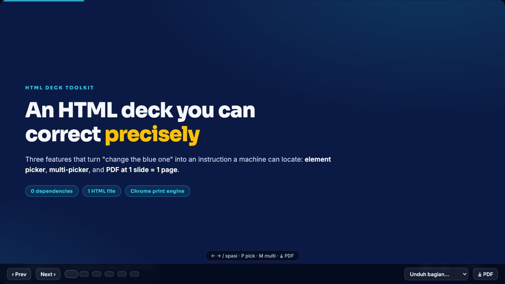
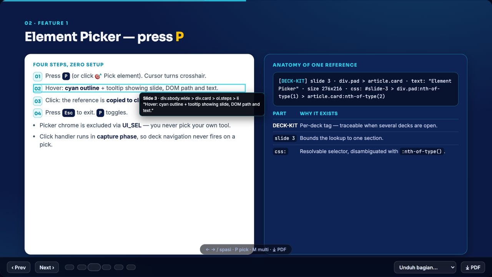
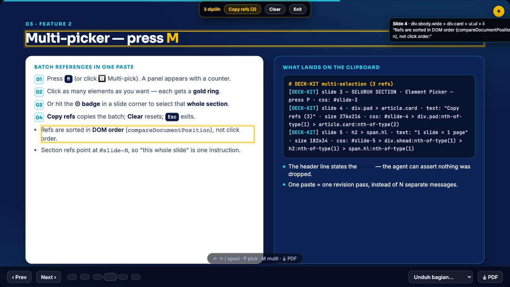

# ai-presentation-html-deck-toolkit

Three features that make an AI-generated HTML slide deck **correctable with precision** instead of
with adjectives: an **element picker**, a **multi-picker**, and a **PDF export that lands as
1 slide = 1 page**.

The problem it solves is mundane and expensive. You ask an agent to change something in a deck and
say *"the blue one, bottom right"*. The agent guesses a DOM path, guesses wrong, and you pay for a
render + review round. This toolkit puts a picker inside the deck HTML you are looking at: you point
at the element, it copies a reference string with a slide number, a readable path, a text snippet and
a machine-resolvable CSS path — then you paste that into the chat. The ambiguity is gone before the
agent starts working.

No build step, no dependencies, no framework. It is one HTML file plus four verification scripts.



```bash
git clone git@github.com:JudgeRozin/ai-presentation-html-deck-toolkit.git
cd ai-presentation-html-deck-toolkit
open deck.html          # macOS; use xdg-open on Linux, start on Windows
```

Press <kbd>P</kbd> to pick one element, <kbd>M</kbd> to pick many, <kbd>M</kbd> then a slide corner
<kbd>⊕</kbd> to grab a whole section, <kbd>Esc</kbd> to leave. <kbd>⤓ PDF</kbd> in the nav prints the
deck: 1280×720 per page, one slide per page, dark backgrounds intact.

| Pick mode — hover marks, click copies | Multi-pick — batch refs, ⊕ grabs a section |
|---|---|
|  |  |

---

## The three features

### 1 · Element Picker — press <kbd>P</kbd>

Toggle with <kbd>P</kbd> or the 🎯 button (both directions). Hover highlights the element under the
cursor in cyan and shows a tooltip with slide number, DOM path and text. Clicking copies a reference
to the clipboard, flashes the element gold, shows a toast with exactly what was copied, and leaves
pick mode. <kbd>Esc</kbd> exits without copying.

```
[DECK-KIT] slide 3 · div.pad > article.card · text: "Element Picker" · size 276x216 · css: #slide-3 > div.pad:nth-of-type(1) > article.card:nth-of-type(2)
```

Three locators in one line, each doing a different job:

| Part | Job |
|---|---|
| `[DECK-KIT]` | Deck tag — which deck this came from when several are open |
| `slide 3` | Bounds the lookup to one section |
| `div.pad > article.card` | Short readable path — a human verifies the target by reading it |
| `text: "…"` | Text snippet (max 90 chars) — the fastest human check |
| `size 276x216` | Sanity check that you picked a box, not a stray inline span |
| `css: #slide-3 > …:nth-of-type(2)` | `:nth-of-type()`-disambiguated selector, resolvable by a script or an agent |

### 2 · Multi-picker — press <kbd>M</kbd>

Multi-pick accumulates selections instead of replacing them: a panel shows the count, every clicked
element keeps a gold ring, and **Copy refs** copies the whole batch as one paste. The <kbd>⊕</kbd>
badge in each slide corner selects that **entire section**, so "restyle this whole slide" is one
instruction rather than a hunt. **Clear** empties the set, <kbd>Esc</kbd> exits.

```
# DECK-KIT multi-selection (3 refs)
[DECK-KIT] slide 2 — SELURUH SECTION · Corrections fail in language · css: #slide-2
[DECK-KIT] slide 2 · p.quote · text: "change the blue one…" · size 512x58 · css: #slide-2 > div.sbody:nth-of-type(1) > div.card:nth-of-type(1) > p.quote:nth-of-type(1)
[DECK-KIT] slide 3 · ol.steps > li · text: "Hover: cyan outline…" · size 512x42 · css: #slide-3 > div.sbody:nth-of-type(1) > div.card:nth-of-type(1) > ol.steps:nth-of-type(1) > li:nth-of-type(2)
```

Two details that matter in practice: the batch header states the **count**, so the receiving agent can
assert it received everything; and references are sorted in **DOM order**, not click order, so the
paste reads like the deck instead of like your clicking history.

### 3 · PDF export — 1 slide = 1 page

The <kbd>⤓ PDF</kbd> button calls `window.print()`; the **Unduh bagian…** dropdown prints a subset.
The whole feature is a `@media print` block — no PDF library, no headless renderer.

```css
@media print{
  @page{size:1280px 720px;margin:0}          /* px, not A4: exact 16:9, no white bars */
  html,body{-webkit-print-color-adjust:exact;print-color-adjust:exact}
  .slide{width:1280px!important;height:720px!important;   /* fixed box, no flex collapse */
    opacity:1!important;visibility:visible!important;transform:none!important;
    page-break-after:always;break-after:page}
  .slide:last-child,.slide.print-last{page-break-after:auto;break-after:auto}
  #nav,#hint,#pickBar,#pickPanel,button{display:none!important}   /* chrome never prints */
}
```

Four print pitfalls are baked into the recipes, each one measured rather than guessed:

1. **Fixed slide height.** Letting slide height follow content lets flex children collapse and text
   spill out of its cards. Pin `width/height` with `!important`.
2. **Absolute line-heights for large text.** Chrome's print engine sizes lines from the font's
   ascent+descent, not `font-size × line-height` — a 52px title inflates to ~72px of ink and overlaps
   the block beneath it. Pin `line-height` in px inside the print block.
3. **The last slide needs an exemption.** Both the full deck and a subset need their final page to
   drop `page-break-after`, and `:last-of-type` is *not* enough for a subset, where the last printed
   slide is not the last in the document — hence the explicit `.print-last` class (cleaned up on
   `afterprint`).
4. **`afterprint` is the only reliable cleanup hook.** `window.print()` blocks in Chrome, but not
   everywhere; the deck also arms a failsafe timeout so subset state cannot get stuck.

Full recipe, pitfalls and reference numbers: [`docs/pdf-export.md`](docs/pdf-export.md).

---

## What's in the repo

```
deck.html                 working 6-slide deck with all three features installed
docs/element-picker.md    the picker: UX contract, reference format, implementation notes
docs/pdf-export.md        the print CSS recipe, pitfalls and measured reference numbers
tools/check_deck.py       static check: picker wiring, section balance, SVG, font floor
tools/check_features.py   behavioural check: drives the deck in Chromium and asserts the features
tools/fit_check.py        layout check: text ink boxes — overflow, out-of-canvas, collisions
tools/check_pdf_export.py print check: page count/size, and per-word overflow in the real PDF
tools/mutation_test.sh    proves the four checkers above can actually FAIL
```

### Verifying

```bash
python3 tools/check_deck.py deck.html --tag DECK-KIT        # no browser needed
python3 tools/check_features.py deck.html                    # needs playwright
python3 tools/fit_check.py deck.html --ignore 'h1.cover-title x em'
python3 tools/check_pdf_export.py deck.html --expect 6       # needs Chrome + poppler
bash   tools/mutation_test.sh deck.html                      # breaks the deck 10 ways on purpose
```

`check_deck.py` needs nothing but Python. The other three need
`pip install playwright && playwright install chromium`; the PDF one additionally needs poppler
(`brew install poppler`) and Chrome. If Chromium lives somewhere else, set `PLAYWRIGHT_CHROME`.

### Verified state of this repo

Every number below came from running the commands above against `deck.html` on macOS with Google Chrome
145.0.7632.160 (arm64), poppler 26.09.0 and Playwright's Chromium 1223:

| Checker | Result |
|---|---|
| `check_deck.py` | PASS — 11 picker ids, 6 balanced sections, 1 SVG parses as XML, no content font under 12px |
| `check_features.py` | 36 checks, 0 failed — picker, guards, multi-pick batch, PDF button and subset state |
| `fit_check.py` | LAYOUT OK — 6/6 slides, no ink bleed, no out-of-canvas text, no collisions; 34–363px of slack per slide |
| `check_pdf_export.py` | 6 pages, every page 1280×720 px, 0 words out of bounds, 0 collisions, 0 empty pages |
| `mutation_test.sh` | caught 14, missed 0 |

The one thing not claimed: the picker's OS clipboard round-trip is a warning, not a pass, in headless
Chromium (it refuses clipboard reads on `file://`). The payload itself is asserted by stubbing
`navigator.clipboard.writeText`, which is the part that carries the feature's meaning.

### Why `mutation_test.sh` exists

A verifier that is always green is worse than no verifier: it certifies nothing. So each defect class
is injected into a copy of the deck — overlapping headings, a card too short for its content, a
footer pushed off-canvas, a removed capture-phase click, a renamed picker id, A4 page size, a broken
subset, disabled print rules, removed DOM ordering, a removed UI guard — and the corresponding tool
must exit non-zero. The result is printed as `caught N, missed 0`, and every "NOT CAUGHT" is a hole in
the tooling rather than a passing test.

## Using it in your own deck

Copy three blocks from `deck.html`, marked in the source as `FEATURE 1 + 2` (picker CSS, DOM, JS) and
`FEATURE 3` (print CSS, dropdown JS), then adapt:

| Adapt | What it means |
|---|---|
| `DECK_TAG` | Anything uppercase, e.g. `Q3-REVIEW`. It prefixes every reference. |
| `UI_SEL` | Every piece of deck chrome that must never be pickable (nav, hints, badges…) |
| `.slide` / `.canvas` selectors | The picker walks up to these two to bound its paths and the slide number |

Three things the code depends on, in both directions:

- **`<section class="slide" id="slide-N">`** — slide numbers in references come from that id, and the
  checks expect them sequential. Decks using `id="sN"` need renaming first.
- **The picker JS must be the last script block** so the deck's own navigation functions exist when a
  pick suppresses a click.
- **Don't declare a second global named `slides`** — a helper block outside the nav IIFE cannot see a
  variable that was declared inside it, so `deck.html` shares the slide list through `window.__deck`.
  For the same reason the PDF toast is `pdfToast()`, not `toast()`: the picker owns that name.

Finally, keep the two habits the tooling exists to enforce: run the checkers before shipping, and
paste references back verbatim instead of paraphrasing them.

---

Built from the working practice of the PaDi UMKM / VMS deck projects. The picker contract, the print
recipes and the verifier scripts are the versions that survived real edit rounds, including the
bugs their comments describe.

MIT licensed — see [LICENSE](LICENSE).
